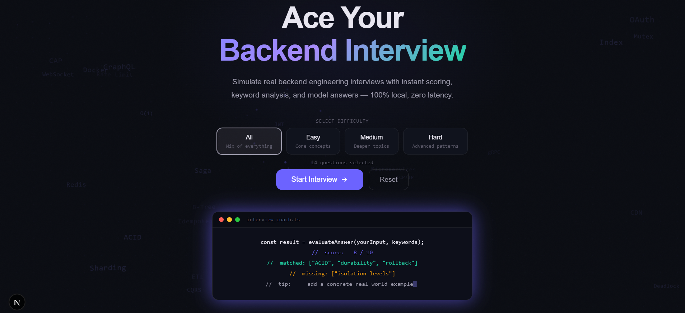
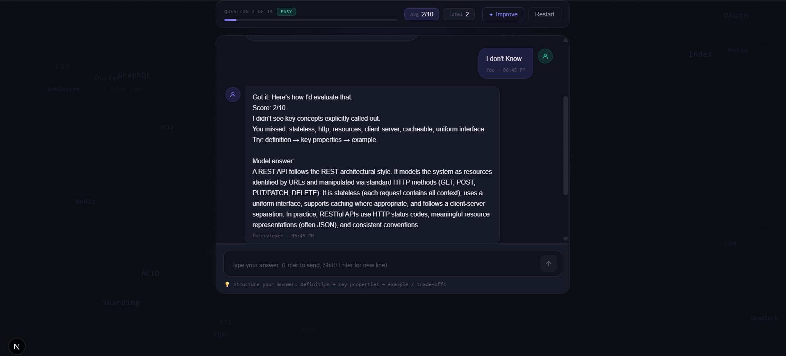

🚀 Backend Interview Coach

An interactive AI-powered chatbot designed to help users prepare for backend developer interviews through structured questions, real-time responses, and guided practice.

📌 Overview

Backend Interview Coach is a purpose-built chatbot that simulates a technical interview experience. It focuses on backend concepts such as APIs, databases, system design, and coding fundamentals.

The goal is to provide a focused, distraction-free preparation tool rather than a generic chatbot.

This project was built as part of a backend developer intern assignment to demonstrate frontend architecture, component design, and chatbot interaction logic.

✨ Features

💬 Interactive chatbot UI for interview-style conversations

🧠 Predefined backend interview questions dataset

⚡ Real-time message rendering with loading states

🎯 Focused domain: Backend development concepts

🧩 Modular and reusable component architecture

🎨 Clean and responsive UI

🛠️ Tech Stack

Frontend: Next.js (App Router)

Language: TypeScript

Styling: CSS / Tailwind (if used)

Architecture: Component-based design

State Management: React Hooks

📂 Project Structure
.
├── app/                # Next.js app directory (pages, layout)
├── components/         # UI components (ChatWindow, InputBox, etc.)
├── lib/                # Static data (interview questions)
├── types/              # TypeScript types
├── public/             # Static assets
└── README.md
⚙️ Getting Started
1. Clone the repository
git clone https://github.com/Atharva-1512/backend-interview-coach.git
cd backend-interview-coach
2. Install dependencies
npm install
3. Run the development server
npm run dev
4. Open in browser
http://localhost:3000
💡 How It Works

The chatbot uses a predefined dataset of backend interview questions

User inputs are matched with relevant responses

UI components dynamically render messages in a conversational format

Loader states simulate real-time AI response behavior

🎯 Key Learning Outcomes

Building a domain-specific chatbot instead of a generic one

Structuring scalable frontend architecture using Next.js

Designing reusable UI components

Managing conversational state effectively

Preparing a project for real-world deployment

🚀 Future Improvements

🔌 Integrate real AI (OpenAI / local LLM)

🗂️ Add categories (DB, APIs, System Design)

📊 Track user performance & analytics

🎙️ Voice-based interview mode

🌐 Deploy with backend API support

📸 Demo 

HOMEPAGE

  

CHAT SECTION

  

RESPONSE PAGE

  

🧑‍💻 Author

Atharva Gade

GitHub: https://github.com/Atharva-1512

📄 License

This project is for educational and assignment purposes.
